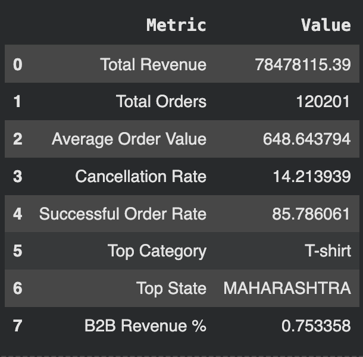
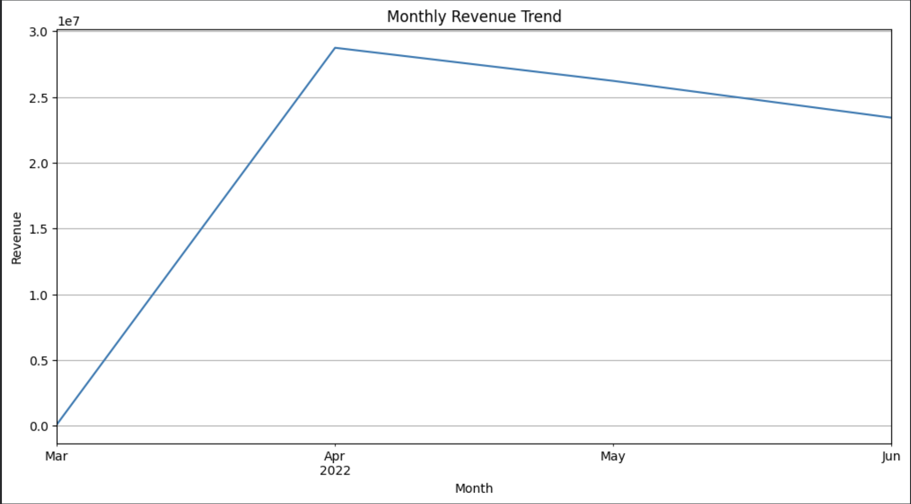
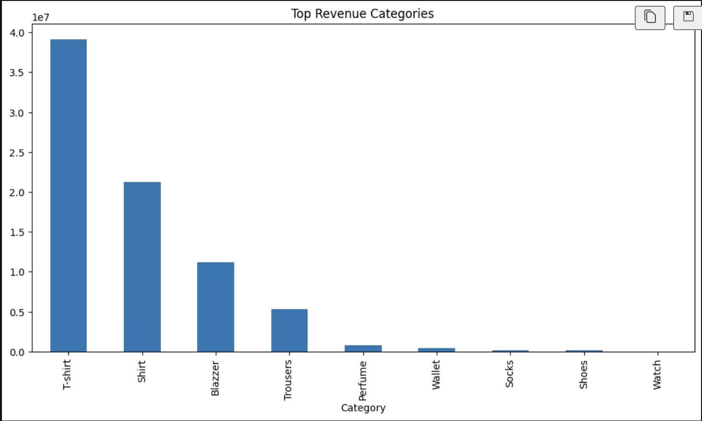
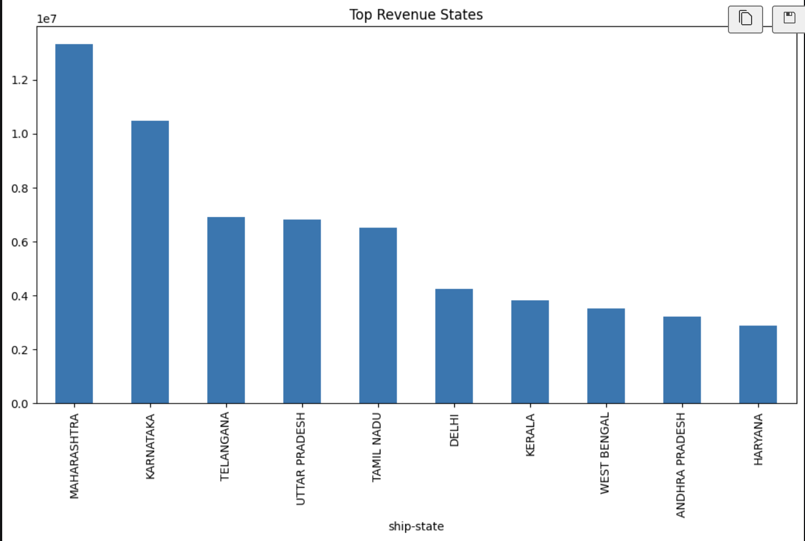
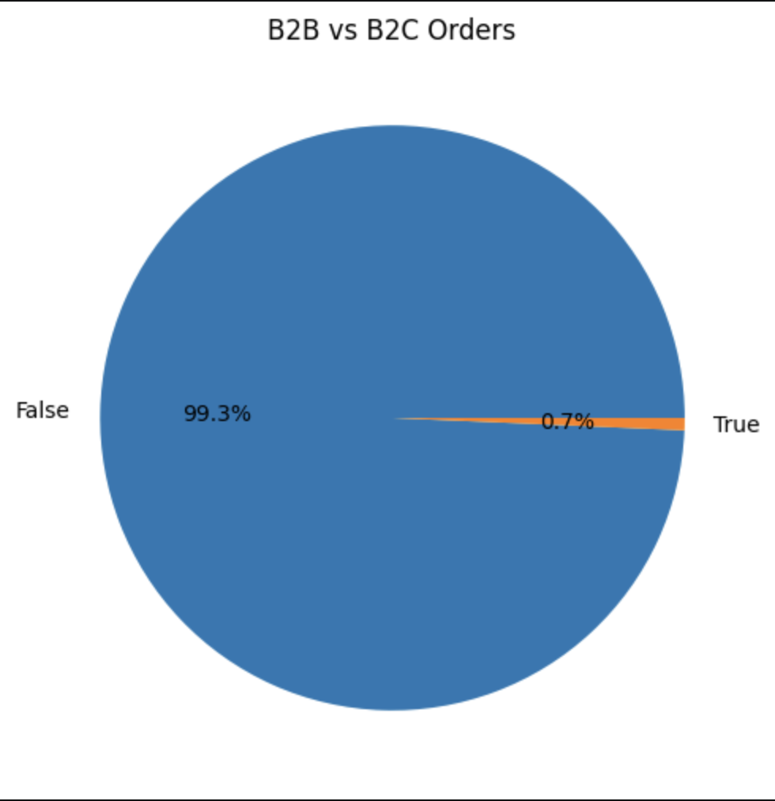
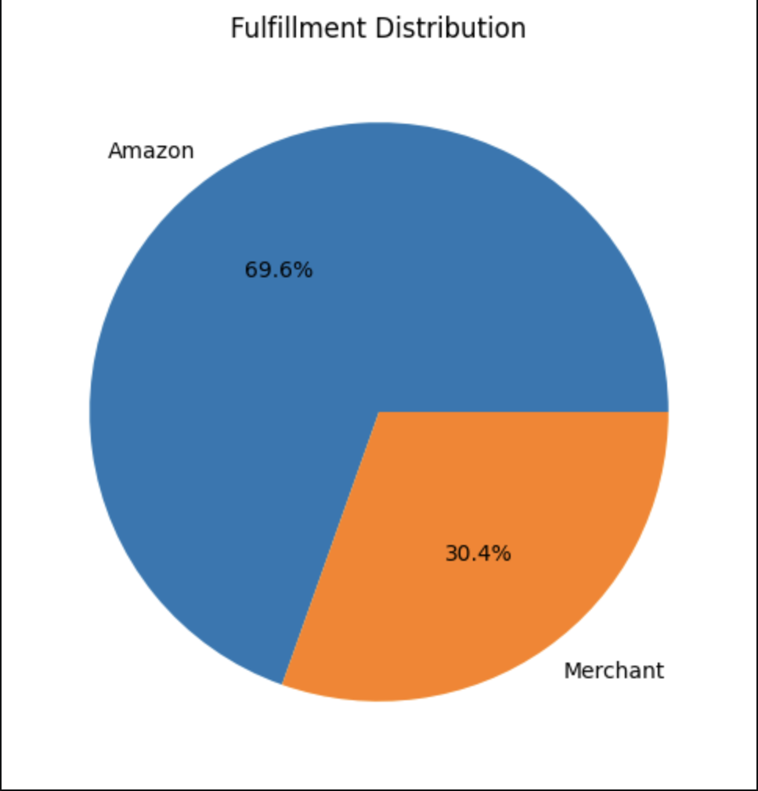

# 📊 Amazon Sales Data Analysis

A complete end-to-end Data Analytics project that analyzes Amazon sales data to uncover business insights, customer behavior, product performance, fulfillment efficiency, and geographical sales trends using Python.

## 📸 Executive Dashboard



## 📌 Project Overview

This project analyzes Amazon sales transactions to answer key business questions related to:

- Sales Performance
- Product Performance
- Customer Segmentation
- Fulfillment Analysis
- Geographical Analysis
- Time Series Trends
- Business Recommendations

The project follows the complete Data Analytics workflow from data cleaning to actionable business insights.

---

## Business Problem

Amazon processes thousands of orders across multiple categories and regions. The objective of this project is to identify actionable business insights that can improve operational efficiency, customer satisfaction, and revenue.

---

## 🛠️ Tech Stack

| Category | Tools |
|----------|-------|
| Programming Language | Python |
| Data Analysis | Pandas, NumPy |
| Visualization | Matplotlib, Seaborn |
| Development Environment | Google Colab, VS Code |
| Version Control | Git & GitHub |

---

## 📂 Dataset Information

| Attribute | Value |
|-----------|-------|
| Total Records | 128,976 |
| Original Columns | 21 |
| Cleaned Columns | 19 |
| Missing Values | Cleaned |
| Duplicate Records | Removed |

---

## 🔄 Project Workflow

1. Data Understanding
2. Data Cleaning
3. Exploratory Data Analysis
4. Sales Analysis
5. Product Analysis
6. Fulfillment Analysis
7. Geographical Analysis
8. Customer Segmentation
9. Time Series Analysis
10. KPI Dashboard
11. Business Insights
12. Strategic Recommendations

---

## 📈 Key Visualizations

### Monthly Revenue Trend



---

### Revenue by Category



---

### Revenue by State



---

### Customer Segmentation



---

### Fulfillment Distribution



---

## 💡 Key Business Insights

- T-shirt category generated the highest revenue.
- Maharashtra contributed the highest sales.
- B2C customers accounted for the majority of orders.
- Approximately 14.2% of orders were cancelled.
- Revenue peaked during April 2022.

---

## 🚀 Business Recommendations

- Prioritize inventory for high-performing products.
- Reduce order cancellations through process improvements.
- Expand marketing in high-revenue regions.
- Improve fulfillment efficiency.
- Build customer retention strategies for B2C buyers.

---

## 📂 Repository Structure

```text
amazon-sales-data-analysis/
│
├── data/
│   ├── raw/
│   │   └── Amazon Sale Report.csv
│   └── processed/
│       └── cleaned_amazon_sales.csv
│
├── notebooks/
│   ├── 01_data_understanding.ipynb
│   ├── 02_data_cleaning.ipynb
│   ├── 03_sales_analysis.ipynb
│   ├── 04_product_analysis.ipynb
│   ├── 05_fulfillment_analysis.ipynb
│   ├── 06_geographical_analysis.ipynb
│   ├── 07_customer_segmentation.ipynb
│   ├── 08_time_series_analysis.ipynb
│   ├── 09_kpi_dashboard_metrics.ipynb
│   ├── 10_correlation_and_insights.ipynb
│   ├── 11_executive_dashboard.ipynb
│   ├── 12_data_storytelling.ipynb
│   └── 13_business_recommendations.ipynb
│
├── reports/
│   └── amazon_sales_analysis_report.md
│
├── images/
│   ├── dashboard.png
│   ├── monthly_revenue.png
│   ├── category_sales.png
│   ├── state_sales.png
│   ├── customer_segment.png
│   └── fulfillment.png
│
├── README.md
├── requirements.txt
├── .gitignore
└── LICENSE

---

## ⚙️ How to Run

1. Clone the repository.

```bash
git clone https://github.com/lakshay-png/amazon-sales-data-analysis.git
cd amazon-sales-data-analysis

pip install -r requirements.txt
```

2. Open the project in VS Code or Google Colab.

3. Run the notebooks in order from
   `01_data_understanding.ipynb`
   to
   `13_business_recommendations.ipynb`.

---

## 🌸 Future Improvements

- Develop an interactive Power BI dashboard.
- Build sales forecasting models.
- Predict order cancellations using Machine Learning.
- Perform customer lifetime value analysis.
- Deploy the project as a web application.
```
---

## 👨‍💻 Author

**Lakshay Karwa**

Aspiring Data Analyst passionate about Python, Data Analytics, SQL, and Business Intelligence.

Feel free to connect and explore this project.

```

